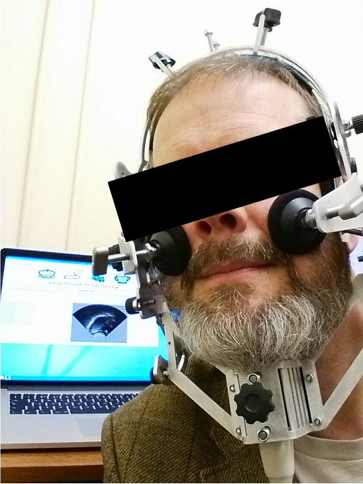
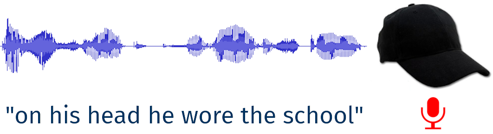
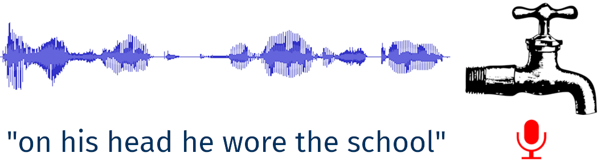
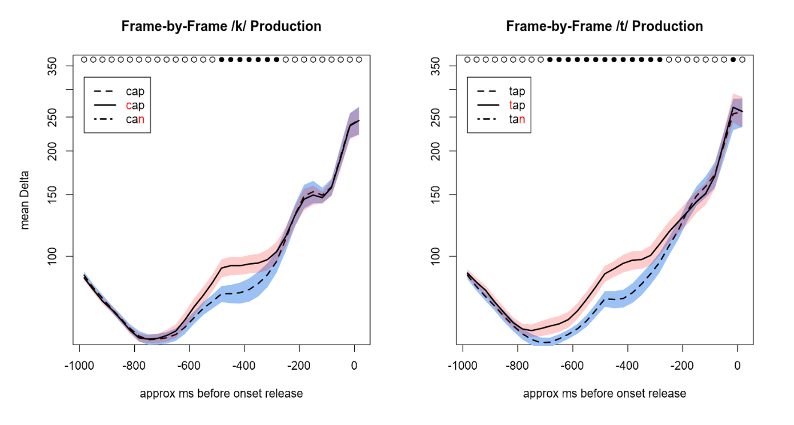
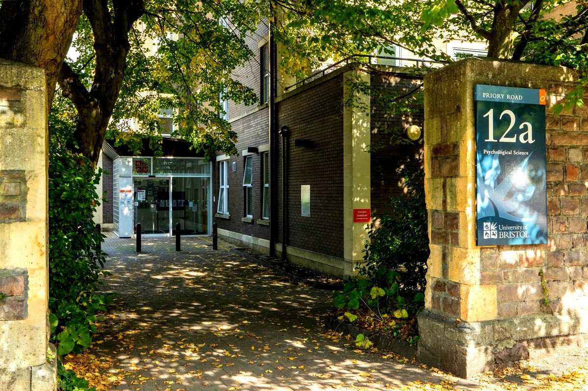
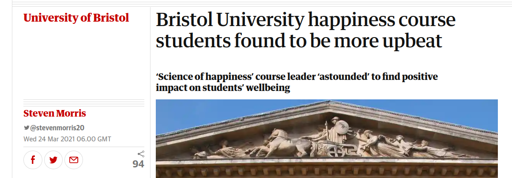
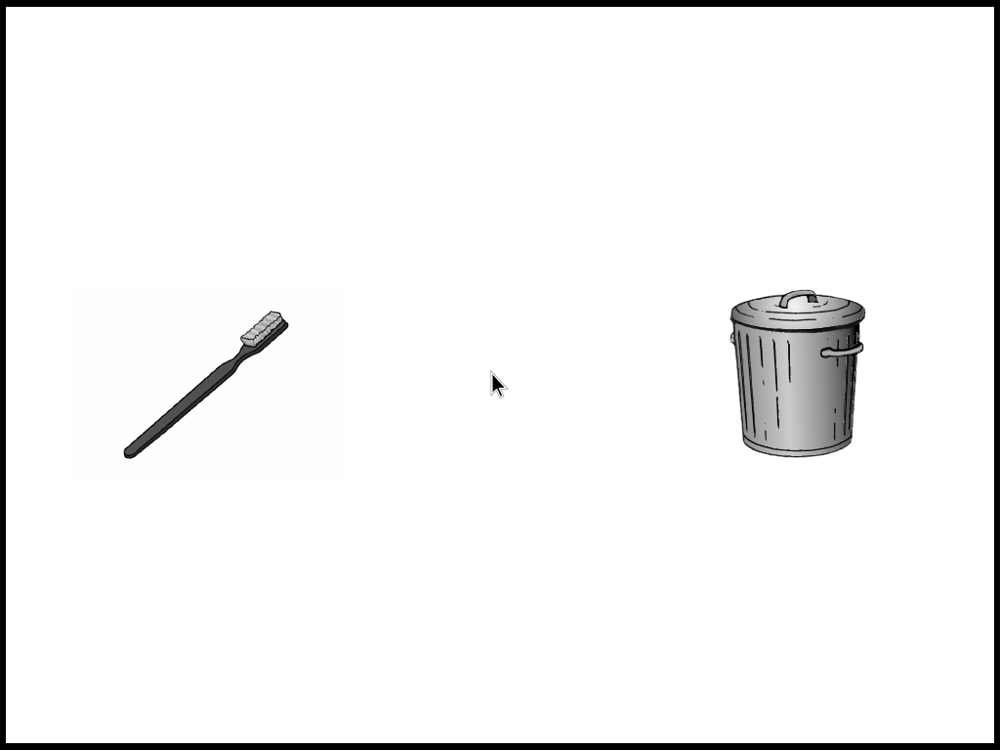
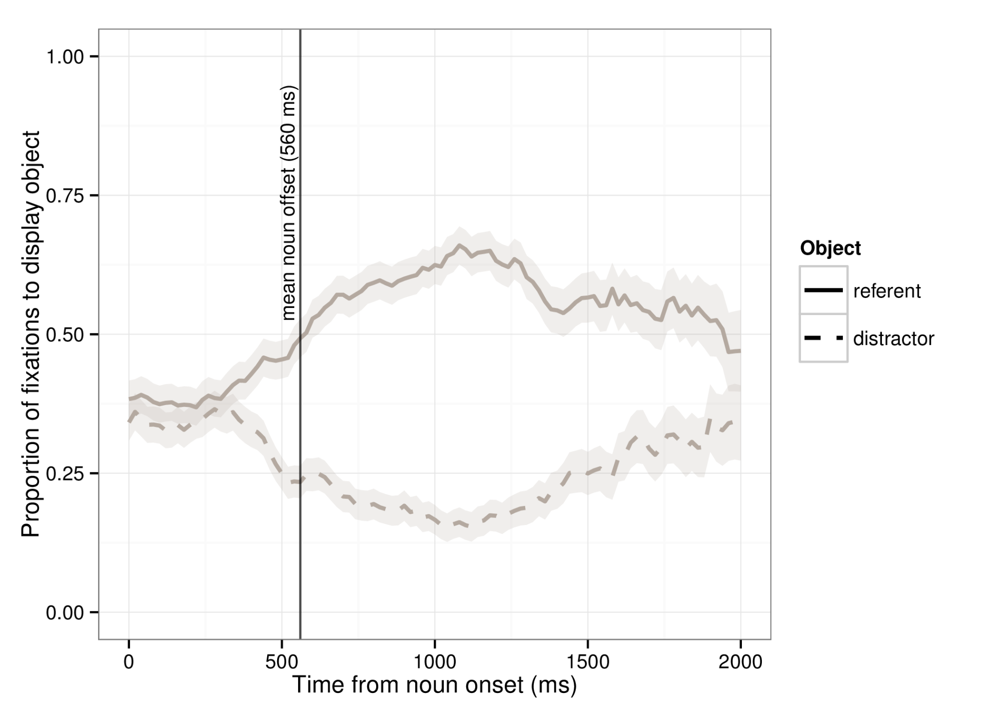

```{r setup, include=FALSE}
options(htmltools.dir.version = FALSE)
options(digits=4,scipen=2)
options(knitr.table.format="html")
xaringanExtra::use_xaringan_extra(c("tile_view","animate_css","tachyons"))
xaringanExtra::use_extra_styles(
  mute_unhighlighted_code = FALSE
)
#library(ggplot2)
knitr::opts_chunk$set(
  dev = "svg",
  warning = FALSE,
  message = FALSE,
  cache = TRUE,
  fig.showtext = TRUE
)
```
class: inverse, center, middle

# Martin Corley

# University of Bristol

## March 25, 2021

.pt5[
these slides: [mmbcorley.github.io/bristol/](https://mmbcorley.github.io/bristol/)
]

---
# Mini CV
.flex.items-start[
.w-70.pa2.f3[
- 2019: Professor of Speech, Language, & Cognition

- 2016: Head of Psychology

- 2010: Senior Lecturer

- 1996: PhD, Exeter

- 1995: Lecturer

- 1989: Research Associate, Exeter

- 1989: MA (Hons) Psychology & Linguistics
]
.w-30.pa2[

]]

---
class: inverse, center, middle

# Research

---
# Research

- redistribution/increase of grant capture in Psychology

  + research-friendly and ECR-friendly policies front and centre

--
  
- personal research: speech, communication (_h_=32)

  + what do speech errors reveal about speech planning?
  
  + how is speech with errors or disfluencies understood?
  
  + how does manner of speaking affect pragmatic understanding?
  
- 22 PhD students; reviewer for everyone; editor for OUP

---
count: false
# Research

- redistribution/increase of grant capture in Psychology

  + research-friendly and ECR-friendly policies front and centre

- personal research: speech, communication (_h_=32)

  + .edi-softblue[what do speech errors reveal about speech planning?]
  
  + how is speech with errors or disfluencies understood?
  
  + how does manner of speaking affect pragmatic understanding?
  
- 22 PhD students; reviewer for everyone; editor for OUP

---
# Articulation Studies
.pull-left[.center[

]]
.pull-right[
- imaging of tongue surface

- typical research question:

> does predicting what you'll hear involve the language production system?

.right[.f3[(e.g., Drake & Corley, 2015)]]
]
---
# Articulation Studies
.center[



]
???
maybe a slide to set the research question?
---
count: false
# Articulation Studies
.center[



]
---
# Articulation Studies
.center[
<video width= "60%" controls>
  <source src="index_files/img/pred2.mp4" type="video/mp4">
  video not supported by this browser
</video>
]
---
class: center, middle

---
# Articulation Studies
.center[

]
<!-- .right[.f3[(Drake & Corley, 2015)]] -->
---
class: inverse, center, middle

# Teaching

---
# Teaching

- full redesign of Edinburgh's BSc and MSc curricula

  - started from a discussion (with students) of desired graduate attributes

  - emphasis on _skills_ as well as _knowledge_

  - student support built-in (redesigned "personal tutor" system)
  
  - unashamedly heavy on modern (quant and quali) methods

--

- personal teaching: psycholinguistics; quant methods

---
# Teaching 2020-21

.pull-left[
- MSc-level quant methods in R "from scratch"

- recorded lectures; workbooks; online support

- lectures and materials [available open-access](https://open.ed.ac.uk/univariate-statistics-methodology-in-r-usmr/)


]
.pull-right[

]

---
# Teaching 2020-21

- overall evaluation **4.7** (56 respondents/113)

- nominated for 3 teaching awards


> Martin Corley is a really great lecturer. He explains everything so clearly that I got a real intuition for the motivation and reasoning
underlying all the statistical methods covered. He is also very gentle and approachable, which makes for a much happier learning
environment.

.right[.f3[(student feedback)]]
---
class: inverse, center, middle

# Leadership

---
# Experience

- improving the dept

  + 16th in THES rankings
  
  + 15th in Times/Sunday Times Good University guide
  
  + NSS 2020 overall satisfaction up 17%

- supporting staff

  + 13 staff (5♀) promoted, 10 (5♀) appointed in last 5 years
  
  + policies to support and retain staff

???
I can't say anything about the REF just yet but our hopes are high
---
# Experience

- supporting students

  + complete revamp of student support
  
  + complete revamp of communications/documentation

- partnership

  + outreach courses
  
  + widening participation programme
  
  + increased industry and governmental links

---
# Approach

- strategic

- consultative, democratic, team-building

- important to be able to articulate _why_ things are done

> Listening, taking advice, facilitating discussion, flexible. People say that when they meet you they find a way forward [...] Clear articulation of direction makes it easier for others to work out their career.

.right[.f3[(360° review)]]

---
# Weaknesses
- not a natural administrator

- geeky, and opinionated

- unlikely to "keep head down"

---
class: inverse, center, middle, animated, bounceInRight

# Vision for the School

---
# I Don't Know Very Much (Yet)

.flex.items-end[
.pa2.w-20[

]
.w-80.pa2[
- ~ 1,100 people who know more than me

- listen to staff (1-3), PSS, PhD/MSci students, UG students

  - find out what's going well, and support it

  - facilitate good ideas

  - suggest possible future approaches
]]

---
# Issues I've Picked Up On

.pull-left[
- space

- research consolidation

- student numbers

- student satisfaction
]
.pull-right[

]
---
# Space

.flex.items-center[
.pa2.w-25[

]
.pa2.w-75[
- .edi-softblue[continued campaign for new space]

- confirm "space according to need" policy

- new ways of working, rethink what's there

  + e.g., "laptop-first" strategy?
  
  + e.g., rethink (some) small-group teaching?

- split buildings as last resort
]]
---
# Research

.center[

]

---
count: false
# Research

- diminishing money in UK will increase role for centres, CDTs

- partner working of increasing importance

- far-east collaborations; ARIA, whatever that turns out to be

--

- plan ahead for bigger bids

  + centre for health behaviours?
  
  + CDT in cognitive science (with computer science)?
  
  + cross-university bids (Zero Carbon)?

---
# Research

- Bristol is quite "top-heavy", need to plan for the future

  + hiring plans (new area? consolidate existing?)

- built-in support for ECR (and middle!)

  + reductions in teaching, incentives to submit grants
  
  + biased PhD studentship allocations
  
  + mentoring, Co-I, career development


---
# Student Numbers

.left-column[

]
.right-column[
- influx of students (56% increase against 8% FTE)

- workload and space issues


]
---
count: false
# Student Numbers

.left-column[

]
.right-column[
- influx of students (56% increase against 8% FTE)

- workload and space issues


- consolidate teaching, find efficiencies

  + marking is often a time sink

- consider focus on fewer programmes
]
---
# Student Satisfaction
- .edi-softblue[be able to articulate to students why we do what we do]

  + teaching as a team activity, everyone invested
  
  + vertical and horizontal integration of courses
  
  + students are surprisingly receptive to challenge

- provide first-class student support

  + professionalise some aspects?

- career pathways, advice, skills emphasis, partnership
---
class: inverse
# Visibility

--

.center[

]

--

- PsychSci is a great school, but not everybody seems to know

  + important internally (changes need traction and support)
  
  + important externally (rankings, etc.)

???
happiness 20-credit course given by Bruce Hood
---
background-image: url("index_files/img/newbuild.jpg")
background-position: center
background-size: 100%

# .tc[School of Psychological Sciences 2028]
--

.br3.pa2.edi-softblue[
.flex.items-start[
.w-50.pa2[
- new building

  + new ways of working

- research centres

  + e.g., CDT, Zero Carbon, ...
]
.w-50.pa2[
- refocused teaching

- _planned_ size

- increased diversity

- embedded in community
]]]

--
<br/>

.br3.edi-orange.pa2.tc.animated.slideInRight[
marquee event to celebrate 120th year
]

---
class: inverse, center, middle

# Thank You

.pt4[&nbsp;]

[mmbcorley@gmail.com](mailto:mmbcorley@gmail.com)

---
class: inverse, center, middle

# Appendix


---
class: animated, bounceInRight
# Disfluency Studies
.pull-left[
- eyetracking


- typical research question:

> how, and how quickly, does disfluency affect the way we understand what is being said?

.right[.f3[(e.g., Loy, Rohde, & Corley, 2017)]]

]
.pull-right[
.center[

]]
---
# Disfluency Studies
<br/>

.center[

]
---
# Disfluency Studies
.center[

]
.right[
<audio src="index_files/img/treasure.mp3" controls></audio>
]
---
# 
# Disfluency Studies
.center[

]
---
count: false
# Disfluency Studies
.center[

]
