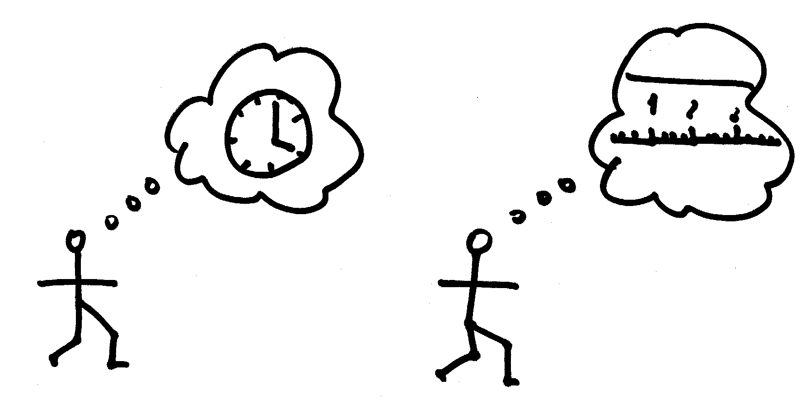
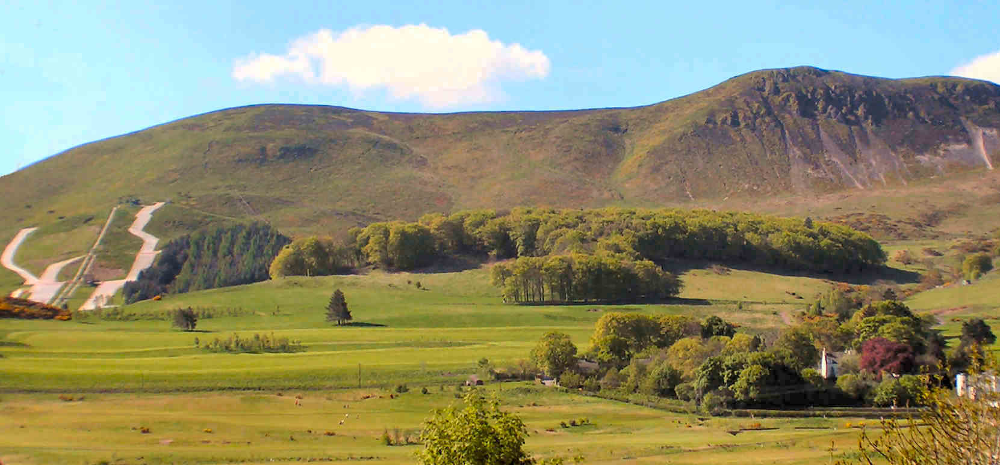
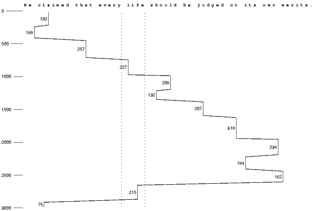
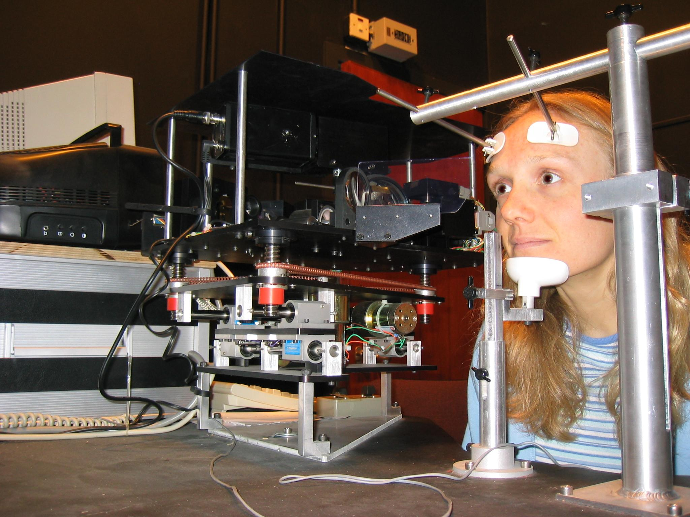
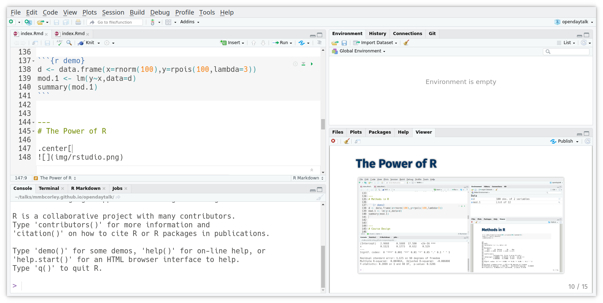
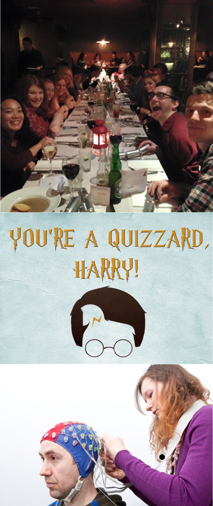

# Psychology
## the science of human behaviour
- what makes people fall in love?
- what makes people become soccer hooligans?
- how does advertising affect people?

--

## ...and also...
- what abilities are people born with?
- how do people use language?
- how do people walk around without bumping into things?
- how do people recognise faces?

---
count: false
# Psychology
## the science of human behaviour
- what makes .red[people] fall in love?
- what makes .red[people] become soccer hooligans?
- how does advertising affect .red[people]?

##...and also...
- what abilities are .red[people] born with?
- how do .red[people] use language?
- how do .red[people] walk around without bumping into things?
- how do .red[people] recognise faces?

---
# These are Complicated Questions

.center[

]
---
count: false
# These are Complicated Questions

.center[

]
---
  # Bump
.center[
<video width="70%" autoplay muted>
  <source src="img/video/bump1.mp4" type="video/mp4">
  video not supported by this browser
</video>
]
.right[.tiny[©BBC]]

- we need to look ahead of ourselves every 8s or so

---
# Time or Distance?

.center[

]

---
# Time or Distance?

.center[

]

---
# Even Basic Activities are Complex

.center[

]
---
# ...When Measured Appropriately

.center[

]

---
class: edi-softblue, middle, center, animated, bounceInDown
.pull-left[
# Psychology at Edinburgh
<br/><br/>
## Psychology BSc
<br/>
## Joint Hons Degrees
]
.pull-right[
.center[

]]
---
# BPS Areas of Psychology

- Biological Psychology
- Cognitive Psychology
- Developmental Psychology
- Differential Psychology
- Social Psychology

- Specialist/Advanced Areas
  - Clinical, Educational, Occupational
  
- .red[Research Methodology]

---

# Course Design

<br/>

  |  |  |  | &nbsp;
---|-------------------|---------|------------|----------
.red[Y1] &nbsp;&nbsp;&nbsp;&nbsp;| .red[Basic Psychology]  &nbsp;&nbsp;&nbsp;&nbsp; | Methods &nbsp;&nbsp;&nbsp;&nbsp; | Other Stuff &nbsp;&nbsp;&nbsp;&nbsp; |  
.red[Y2] &nbsp;&nbsp;&nbsp;&nbsp; | .red[Basic Psychology] &nbsp;&nbsp;&nbsp;&nbsp; | Methods &nbsp;&nbsp;&nbsp;&nbsp; | Other Stuff  &nbsp;&nbsp;&nbsp;&nbsp; |  
Y3 &nbsp;&nbsp;&nbsp;&nbsp; | Mini-Dissertation &nbsp;&nbsp;&nbsp;&nbsp; | Methods &nbsp;&nbsp;&nbsp;&nbsp; | Critical Analysis &nbsp;&nbsp;&nbsp;&nbsp; | Electives
Y4 &nbsp;&nbsp;&nbsp;&nbsp; | Dissertation &nbsp;&nbsp;&nbsp;&nbsp; |               | Tutorials &nbsp;&nbsp;&nbsp;&nbsp; | Electives

---
# The Way We Teach
.left-column[

]

.right-column[

- lectures
  - cover core topics in Psychology; guide reading
- tutorials
  - allow discussion and learning in depth
- labs
  - focus on "doing" psychology

]
---
# Course Design

<br/>

  |  |  |  | &nbsp;
---|-------------------|---------|------------|----------
.red[Y1] &nbsp;&nbsp;&nbsp;&nbsp;| Basic Psychology  &nbsp;&nbsp;&nbsp;&nbsp; | .red[Methods] &nbsp;&nbsp;&nbsp;&nbsp; | Other Stuff &nbsp;&nbsp;&nbsp;&nbsp; |  
.red[Y2] &nbsp;&nbsp;&nbsp;&nbsp; | Basic Psychology &nbsp;&nbsp;&nbsp;&nbsp; | .red[Methods] &nbsp;&nbsp;&nbsp;&nbsp; | Other Stuff  &nbsp;&nbsp;&nbsp;&nbsp; |  
.red[Y3] &nbsp;&nbsp;&nbsp;&nbsp; | Mini-Dissertation &nbsp;&nbsp;&nbsp;&nbsp; | .red[Methods] &nbsp;&nbsp;&nbsp;&nbsp; | Critical Analysis &nbsp;&nbsp;&nbsp;&nbsp; | Electives
Y4 &nbsp;&nbsp;&nbsp;&nbsp; | Dissertation &nbsp;&nbsp;&nbsp;&nbsp; |               | Tutorials &nbsp;&nbsp;&nbsp;&nbsp; | Electives

---
# The Way We Teach

```{r demo}
d <- data.frame(x=rnorm(100),y=rpois(100,lambda=3))
mod.1 <- lm(y~x,data=d)
summary(mod.1)
```


---
# The Power of R

.center[

]

---
# Course Design

<br/>

  |  |  |  | &nbsp;
---|-------------------|---------|------------|----------
.red[Y1] &nbsp;&nbsp;&nbsp;&nbsp;| Basic Psychology  &nbsp;&nbsp;&nbsp;&nbsp; | Methods &nbsp;&nbsp;&nbsp;&nbsp; | .yellow[Other Stuff] &nbsp;&nbsp;&nbsp;&nbsp; |  
.red[Y2] &nbsp;&nbsp;&nbsp;&nbsp; | Basic Psychology &nbsp;&nbsp;&nbsp;&nbsp; | Methods &nbsp;&nbsp;&nbsp;&nbsp; | .yellow[Other Stuff]  &nbsp;&nbsp;&nbsp;&nbsp; |  
Y3 &nbsp;&nbsp;&nbsp;&nbsp; | Mini-Dissertation &nbsp;&nbsp;&nbsp;&nbsp; | Methods &nbsp;&nbsp;&nbsp;&nbsp; | Critical Analysis &nbsp;&nbsp;&nbsp;&nbsp; | Electives
Y4 &nbsp;&nbsp;&nbsp;&nbsp; | Dissertation &nbsp;&nbsp;&nbsp;&nbsp; |               | Tutorials &nbsp;&nbsp;&nbsp;&nbsp; | Electives


---
count: false
# Course Design

<br/>

  |  |  |  | &nbsp;
---|-------------------|---------|------------|----------
Y1 &nbsp;&nbsp;&nbsp;&nbsp;| Basic Psychology  &nbsp;&nbsp;&nbsp;&nbsp; | Methods &nbsp;&nbsp;&nbsp;&nbsp; | Other Stuff &nbsp;&nbsp;&nbsp;&nbsp; |  
Y2 &nbsp;&nbsp;&nbsp;&nbsp; | Basic Psychology &nbsp;&nbsp;&nbsp;&nbsp; | Methods &nbsp;&nbsp;&nbsp;&nbsp; | Other Stuff  &nbsp;&nbsp;&nbsp;&nbsp; |  
.red[Y3] &nbsp;&nbsp;&nbsp;&nbsp; | Mini-Dissertation &nbsp;&nbsp;&nbsp;&nbsp; | Methods &nbsp;&nbsp;&nbsp;&nbsp; | Critical Analysis &nbsp;&nbsp;&nbsp;&nbsp; | .red[Electives]
.red[Y4] &nbsp;&nbsp;&nbsp;&nbsp; | Dissertation &nbsp;&nbsp;&nbsp;&nbsp; |               | Tutorials &nbsp;&nbsp;&nbsp;&nbsp; | .red[Electives]

---
count: false
# Course Design

<br/>

  |  |  |  | &nbsp;
---|-------------------|---------|------------|----------
Y1 &nbsp;&nbsp;&nbsp;&nbsp;| Basic Psychology  &nbsp;&nbsp;&nbsp;&nbsp; | Methods &nbsp;&nbsp;&nbsp;&nbsp; | Other Stuff &nbsp;&nbsp;&nbsp;&nbsp; | <br/>  
Y2 &nbsp;&nbsp;&nbsp;&nbsp; | Basic Psychology &nbsp;&nbsp;&nbsp;&nbsp; | Methods &nbsp;&nbsp;&nbsp;&nbsp; | Other Stuff  &nbsp;&nbsp;&nbsp;&nbsp; |
.red[Y3] &nbsp;&nbsp;&nbsp;&nbsp; | Mini-Dissertation &nbsp;&nbsp;&nbsp;&nbsp; | Methods &nbsp;&nbsp;&nbsp;&nbsp; | .red[Critical Analysis] &nbsp;&nbsp;&nbsp;&nbsp; | Electives
.red[Y4] &nbsp;&nbsp;&nbsp;&nbsp; | Dissertation &nbsp;&nbsp;&nbsp;&nbsp; |               | .red[Tutorials] &nbsp;&nbsp;&nbsp;&nbsp; | Electives
---
count: false
# Course Design

<br/>

  |  |  |  | &nbsp;
---|-------------------|---------|------------|----------
Y1 &nbsp;&nbsp;&nbsp;&nbsp;| Basic Psychology  &nbsp;&nbsp;&nbsp;&nbsp; | Methods &nbsp;&nbsp;&nbsp;&nbsp; | Other Stuff &nbsp;&nbsp;&nbsp;&nbsp; | <br/>  
Y2 &nbsp;&nbsp;&nbsp;&nbsp; | Basic Psychology &nbsp;&nbsp;&nbsp;&nbsp; | Methods &nbsp;&nbsp;&nbsp;&nbsp; | Other Stuff  &nbsp;&nbsp;&nbsp;&nbsp; |
.red[Y3] &nbsp;&nbsp;&nbsp;&nbsp; | .red[Mini-Dissertation] &nbsp;&nbsp;&nbsp;&nbsp; | Methods &nbsp;&nbsp;&nbsp;&nbsp; | Critical Analysis &nbsp;&nbsp;&nbsp;&nbsp; | Electives
.red[Y4] &nbsp;&nbsp;&nbsp;&nbsp; | .red[Dissertation] &nbsp;&nbsp;&nbsp;&nbsp; |               | Tutorials &nbsp;&nbsp;&nbsp;&nbsp; | Electives

---
# Dissertations
.left-column[

]

.right-column[
- The Role of Wealth in Unethical Behaviour
- The Link between Mood and Forgetting
- Religion, Personality, and Risk-Taking
- Autistic Traits and Comprehension
- Linguistic Illusions
- Using Tinder to Examine Self-Sexualisation in 8 Nations 
]
---
# Joint Degrees
<br/>
- joint degrees offered with related subjects:

  - Artificial Intelligence
  - Linguistics
  - Sociology
  - Philosophy
  - Economics
  - Business
  
- also *Cognitive Science*

---
# Extras

.left-column[


]

.right-column[
.content-box-yellow[
- personal tutor system
- student support officers
- PsychSoc & PsychPALS]
<br/>
.content-box-purple[
- **year 2**: volunteer research programme
- **year 3**: junior year abroad]
]

---
# Psychology at Edinburgh
<br/><br/>

- world-leading University

- chance to meet, and study with, international experts

- degree focused on the skills needed do *do* psychology

---
# Building on the Skills You Learn...
<br/>

- you can get further qualifications & become a clinical psychologist
<br/>

- you can work as a researcher for various companies
<br/>

- you can go further & get a higher degree
  - this lets you go into academia, maybe as a professor/lecturer
<br/>

- you can go into human resources & corporate management
<br/>

- you can go into consulting & advertising

---
class: edi-softblue, center, middle
# Thank You
.pull-left[
<br/>
Psychology Website:
[www.psy.ed.ac.uk](http://www.psy.ed.ac.uk)
<br/>

Undergraduate Admissions Office:
[CAHSS.UGAdmissions@ed.ac.uk](mailto:CAHSS.UGAdmissions@ed.ac.uk)
<br/>

Student blog:
[www.ppls.blog.ed.ac.uk](http://www.ppls.blog.ed.ac.uk/)
]

.pull-right[
<br/><br/>
.center[
<video width="90%" autoplay muted>
  <source src="img/video/bump2a.mp4" type="video/mp4">
  video not supported by this browser
</video>
.right[.tiny[©BBC]]
]

.right[.tiny[
[Martin.Corley@ed.ac.uk](mailto:Martin.Corley@ed.ac.uk)]
]]
