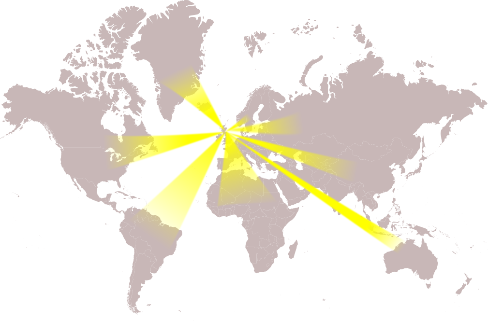
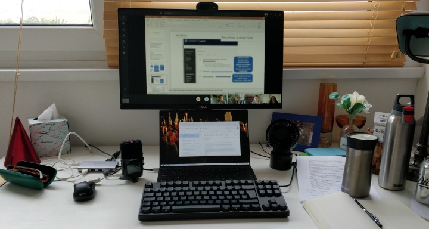
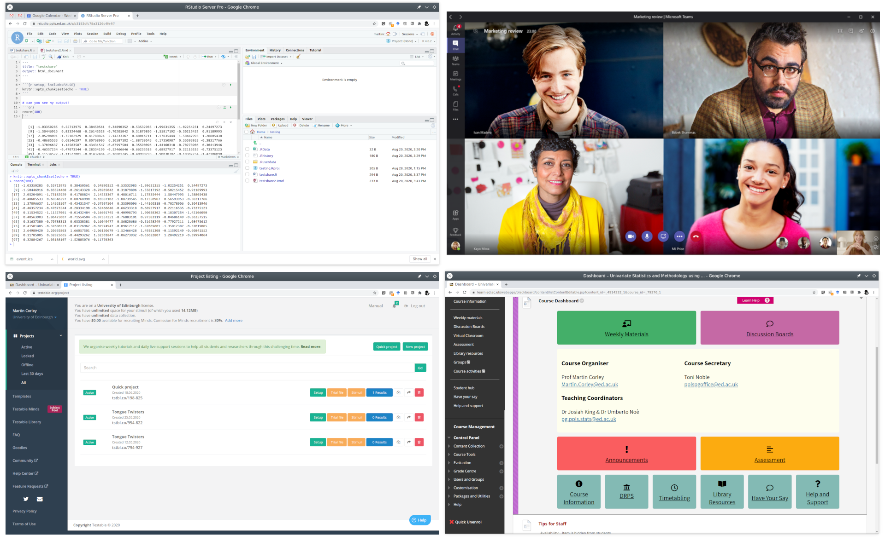
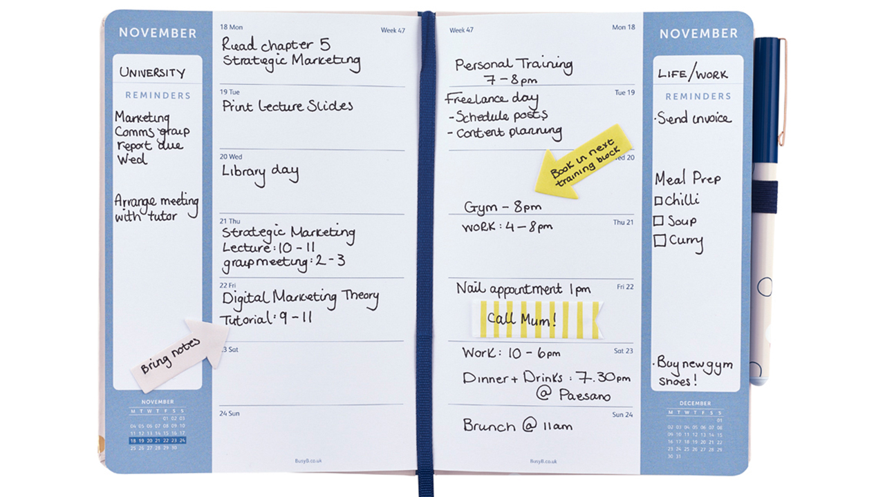
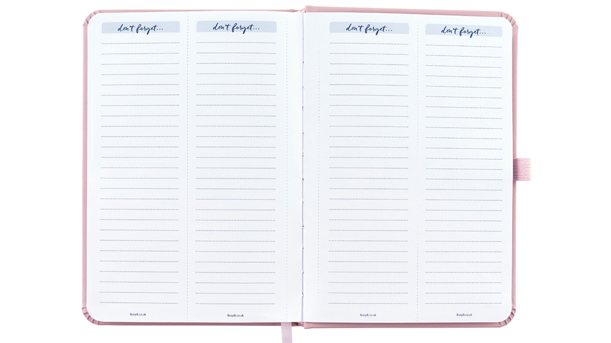
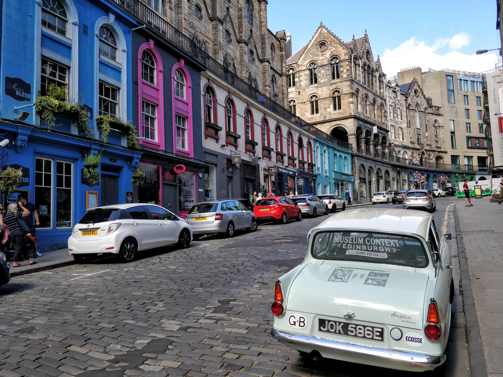
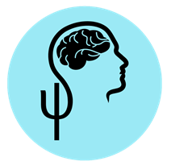

```{r setup, include=FALSE}
options(htmltools.dir.version = FALSE)
options(digits=4,scipen=2)
options(knitr.table.format="html")
xaringanExtra::use_xaringan_extra(c("tile_view","animate_css","tachyons"))
xaringanExtra::use_extra_styles(
  mute_unhighlighted_code = FALSE
)
```

class: center, middle

# WELCOME
--
 (BACK)
---

???
some of you have travelled, and some of you are 'travelling' over the internet, to be with us today.

I want you to know that whichever way you're joining us, you're part of the psychology postgraduate family,

and I look forward to talking to you, virtually or in person, over the year.

---
# Edinburgh Psychology
.flex.items-top[.w-40.pa2[
- founded 1906

- consistently in world top 25

- strong, diverse, research and teaching
]
.w-60.pa2[
.center[

]]]


---
# 7 George Square

.flex.items-center[.w-40.pa2[
- home of Psychology since 1974

- hope to return soon

- study space
]
.w-60.pa2[

]]
???
In a normal year, we'd all be here

in 7 George Square in at the Southern side of Edinburgh's Old Town.

We are working on making parts of the building available for teaching and study.  But we know that much of what we do this year is going to be online.
---

# Working at Home

.flex.items-center[.w-40.pa2[
- temporary home of Psychology

- "offices" all over Edinburgh
  (and beyond)
]
.w-60.pa2[

]]
???
- Introduce staff
9. Rene, Patrick, Martin, Tim, Sharon

3. Rene, Patrick, Elena, Tim, ThomasB, Anne, Rob
---
# The Strange Year of 2020
.center[

]
???
We've been working hard on resources so that we can meet you,
get to know you, and teach you online.

We've been working on this all summer.

We all hope (and I'm sure you do too) that the world will go back to normal soon, but if not, we have the best year we can have ready and waiting for you.
---
# Lots of People

- **René Mõttus**

  Postgraduate Director in Psychology

- **Billy Lee**

  Programme Director, MSc Psychological Research

- **Rob McIntosh, Patrick Sturt, Anne Templeton**

  Personal Tutors (Advisors) for MSc Students
  
- **Henry Barnett, Katie Keltie, Toni Noble, Becky Verdon**

  PG Office

???
When I say "we", I mean a whole bunch of people.

Somewhere out there in the ether there are lots of people who have been working hard throughout the summer.

If you're new, you're not expected to remember all of them right now!

---
.pull-left[
# MSc


]
???
If you're starting an MSc, there will be plenty for you to do as the semester gets going.
--
.pull-right[
# PhD


]
???
If you're doing a PhD, it can be slower for things to get going, but there is actually plenty going on
--

- set up a meeting with supervisor

- talk to people (starting here!)

- find details of [relevant research meetings](https://www.ed.ac.uk/ppls/psychology/research/seminars-and-reading-groups)
---
# Some Things to Do

.flex.items-center[.w-50.pa2[
- if you're in town, happy exploring!
]
.w-50.pa2[

]]
- if you can't be here yet:
  [edinburghtourist.co.uk/virtual-tours](https://edinburghtourist.co.uk/virtual-tours)

---
# Talk to PsychSoc, talk to us!
.flex.items-center[.w-80.pa2[

- [facebook.com/psychsoc.ed](https://www.facebook.com/psychsoc.ed)

]
.w-20.pa2[
.center[

]]]

.pt2[
&nbsp;
]

.br3.center.pa2.bg-moon-gray.white.f4[
these slides: [mmbcorley.github.io/pg_welcome](https://mmbcorley.github.io/pg_welcome)
]
???
I'm going to stop sharing slides now, and ask my colleagues to introduce themselves briefly and say a little about what they do.

After that, I'm going to hand over to the Psychology Society, who have a whole set of things planned for this term and can let you know all about them.