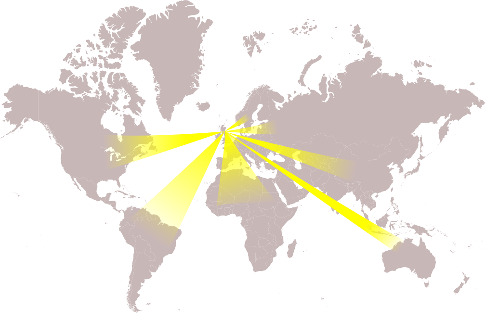

```{r setup, include=FALSE}
options(htmltools.dir.version = FALSE)
options(digits=4,scipen=2)
options(knitr.table.format="html")
xaringanExtra::use_xaringan_extra(c("tile_view","animate_css","tachyons"))
xaringanExtra::use_extra_styles(
  mute_unhighlighted_code = FALSE
)
```

class: center, middle

# WELCOME
---

???
some of you have travelled, and some of you are 'travelling' over the internet, to be with us today.

I want you to know that whichever way you're joining us, you're part of the psychology postgraduate family,

and I look forward to getting to know you, virtually or in person, over the year.

---
# 7 George Square

.flex.items-center[.w-40.pa2[
- home of Psychology since 1974

- hope to return soon

- study space
]
.w-60.pa2[

]]
???
In a normal year, we'd all be here

in 7 George Square in at the Southern side of Edinburgh's Old Town
---
# The Strange Year of 2020
.center[

]
???
Instead, we've been working hard on resources so that we can meet you,
get to know you, and teach you online