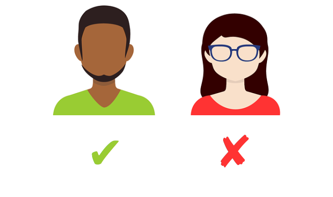
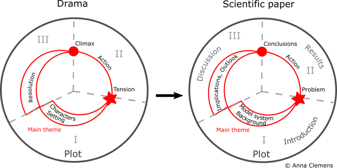
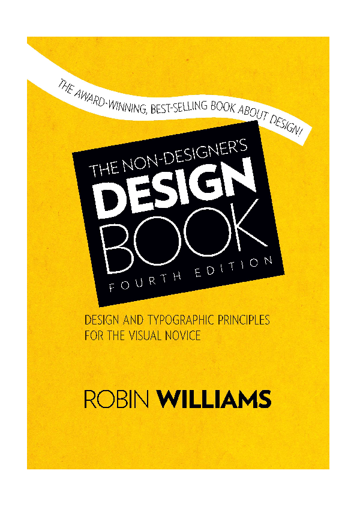
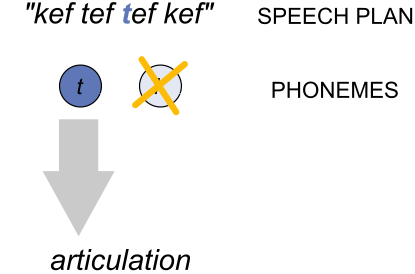
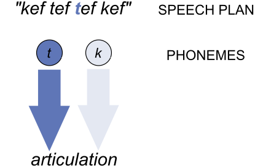
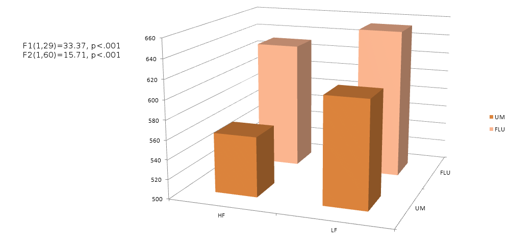
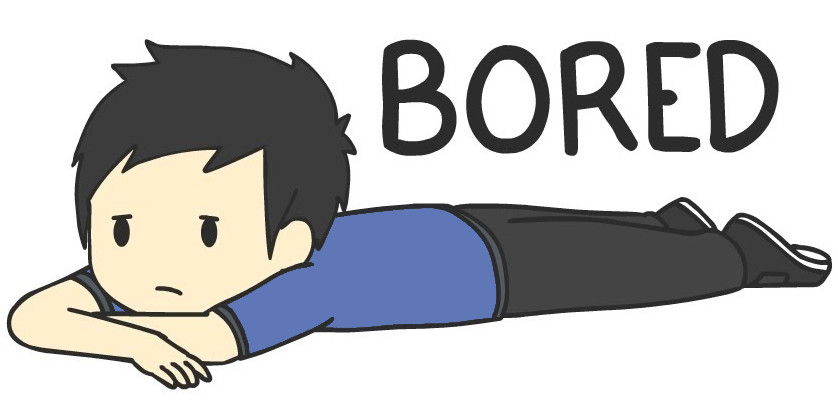

```{r setup, include=FALSE}
options(htmltools.dir.version = FALSE)
options(htmltools.dir.version = FALSE)
options(digits=4,scipen=2)
options(knitr.table.format="html")
xaringanExtra::use_xaringan_extra(c("tile_view","animate_css","tachyons"))
xaringanExtra::use_extra_styles(
  mute_unhighlighted_code = FALSE
)
library(knitr)
library(tidyverse)
library(ggplot2)
knitr::opts_chunk$set(
  dev = "svg",
  warning = FALSE,
  message = FALSE,
  cache = TRUE,
  fig.showtext = TRUE
)
```

```{r xaringan-themer, include=FALSE, warning=FALSE}
library(xaringanthemer)
style_duo_accent(
  primary_color = "#5F76B7",
  secondary_color = "#FCBB06",
  inverse_header_color = "#FFFFFF"
)
```

```{r ggtheme,include=FALSE}
# don't ask me why this only works in a different code block
theme_set(theme_xaringan())
```

# Orientation

- there are quite a few resources and examples linked into these slides

- anything **in purple** that seems like a link probably is

- these slides can be viewed at [https://mmbcorley.github.io/presentations/](https://mmbcorley.github.io/presentations/)

---
class: inverse, middle
## 1. what are you going to say?

.pt3[
## 2. what props do you need?
]

.pt3[
## 3. how are you going to say it?
]
???
- by "props", I mean the slides or poster that you might typically use in academia.  I'm going to try and persuade you that they really _are_ props; the "message" should come from you, not from your visual aids

- "how you're going to say it" refers to the act of speaking, in front of an audience which can be anything from one person in front of a poster to a couple of hundred in an auditorium

---
count: false
class: inverse, middle
## 1. .primary[what are you going to say?]


.pt3[
## 2. what props do you need?
]

.pt3[
## 3. how are you going to say it?
]

---
# The 5 Ws
.pull-left[

- **What** are you presenting?

  + talk? poster? what is it about?
]

---
# Talks

.pull-left[
- usually a sequence of slides

- these are "props"
  + the talk isn't _on_ the slides
  
- in conferences, typically 10-25 minutes
  + lectures, plenaries, much more
]
.pull-right.center[

]
???
- how many slides/minute? (Varies, but fewer can be better)
---
# Posters

.pull-left[
- usually an A1 or A0 poster

- this is a "prop"
  + the message isn't _on_ the poster
  
- in conferences, typically 1-2 hr sessions
  + presenters stand near posters and present/discuss
]

.pull-right.center[

]
???
- for Americans, A0 is a bit like ANSI size **E**
---
# Talks vs Posters

.pull-left[
## Talks > Posters

- talks are more prestigious

- posters might attract more criticism

- posters can be harder to prepare

]

--

.pull-right[
## Posters > Talks

- posters are less scary

- posters get more detailed feedback

- less can go wrong with a poster

]

---

# The 5 Ws
.pull-left[

- **What** are you presenting?
  + talk? poster? what is it about?
  
- **Why** are you presenting it?
  + what's its purpose?
  + what is the take-home message?

]
---
count: false
# The 5 Ws
.pull-left[

- **What** are you presenting?
  + talk? poster? what is it about?
  
- **Why** are you presenting it?
  + what's its purpose?
  + what is the take-home message?

]

.pull-right[
```{r ggp,fig.asp=.6,echo=F}
df <- tibble(x=1:10,y=x/3.6+rnorm(10,sd=1.1))
df %>% ggplot(aes(x=x,y=y)) +
  geom_point() +
  geom_smooth(method="lm") +
  xlab("hrs studying") +
  ylab("understanding") +
  theme_xaringan()
```
]
---
count: false
# The 5 Ws
.pull-left[

- **What** are you presenting?
  + talk? poster? what is it about?
  
- **Why** are you presenting it?
  + what's its purpose?
  + what is the take-home message?

]

.pull-right.center[

]

---
count: false
# The 5 Ws
.pull-left[

- **What** are you presenting?
  + talk? poster? what is it about?
  
- **Why** are you presenting it?
  + what's its purpose?
  + what is the take-home message?

]

.pull-right[

]


---
count: false
# The 5 Ws
.pull-left[

- **What** are you presenting?
  + talk? poster? what is it about?
  
- **Why** are you presenting it?
  + what's its purpose?
  + what is the take-home message?

- **Who** are you presenting to?

- **When** and

- **Where** are you presenting?
]
---


# What should be in my presentation?

- **Background**
  + just enough to motivate the research problem
  
- **Method**

- **Results** and their interpretation/discussion
  + think about statistics/graphs

- **Summary and Conclusions**
  + the all-important take-home message
---
# Telling a Story

.center[

]
.tr[
(Anna Clemens, [Writing a Page-Turner](https://blogs.lse.ac.uk/impactofsocialsciences/2018/05/21/writing-a-page-turner-how-to-tell-a-story-in-your-scientific-paper/))
]
---
# K. I. S. S.

- **K**eep **I**t **S**hort and **S**imple

- Clarity and simplicity are very important
  + help to attract the attention of the audience
  + help to _keep_ their attention
  + make your presentations easier to understand, and remember
  
- You don't have to tell them everything
  + for example, detailed statistics are rarely needed
  + details can make people switch off
  
- Be explicit about the structure of your presentation
  + exploit primacy and recency

---
class: inverse, middle
## 1. what are you going to say?


.pt3[
## 2. .primary[what props do you need?]
]

.pt3[
## 3. how are you going to say it?
]
???
- you're the storyteller; your slides, or poster, are your props.  We'll talk about some general principles for making these look better.
---
# C.R.A.P.

.flex.items-center[
.w-70.pa1[
- **C**ontrast
  + avoid elements that are merely similar
  
- **R**epetition
  + repeat visual elements; consistency creates unity
  
- **A**lignment
  + nothing should be placed on the page arbitrarily
  
- **P**roximity
  + group related information together

]
.w-30.pa1[

]]

---
# Less is More

- long sentences which contain a lot of technical detail, and/or
  TLAs (three-letter acronyms), and/or punctuation (and/or information
  in parentheses) which take up several lines of (possibly quite
  small, poorly spaced) text are not only difficult to read, they also
  distract the audience from listening to what you are actually
  saying...
  
--

.pt3[
- avoid words

  + shorter sentences are more engaging
  
  + try to keep each point to one line
  
  + exploit white space to make the text easier to read
]

---
# Avoid Words

.pull-left[
- most active phoneme is selected

- selected phoneme drives the speech plan
]
.pull-right.center[

]
.pull-left[
- relevant phonemes accrue activation

- activation cascades to articulation

]
.pull-right.center[

]
---
# Simplify Lists

<ul>
<li>bulleted lists can be very useful<br/>&nbsp;</li>


  <ul>
  <li>but be careful there aren't too many levels<br/>&nbsp;</li>
  

    <ul>
    <li>by here, things look messy<br/>&nbsp;</li>
    
    <li>should only use >2 levels if absolutely necessary</li>
    </ul>
  </ul>
</ul>

.pt3[
- it's perfectly possible to make [slides without _any_ bullet points](https://docs.google.com/presentation/d/1oBFoHvNyuvcEIx18j4hVO0jiWTeFjUSReFheegujsIg/edit?usp=sharing)
]

---
class: inverse
background-image: url("index_files/img/bg.svg")

# Style over Substance

.pt2.secondary[
Lorem ipsum dolor sit amet, consectetur adipiscing elit. Sed id ligula feugiat, semper urna vitae, lobortis est. Donec varius lorem eget dolor dictum vehicula. Quisque fermentum nisi sem, id mollis libero finibus eu. Phasellus lacinia efficitur dignissim. Curabitur ut eros non augue ullamcorper consectetur. Aenean semper eros quis urna commodo, pharetra ornare urna efficitur. Orci varius natoque penatibus et magnis dis parturient montes, nascetur ridiculus mus. Cras vehicula fringilla nisl. Proin venenatis elit eget euismod pretium. Proin id arcu nisi. Maecenas tristique, eros a pharetra viverra, tellus metus volutpat nisl, vitae interdum enim mauris non diam. Pellentesque placerat convallis odio.
]

---
# Style over Substance

.center[

]

---
# Substance over Style

.center[
```{r graph,echo=F,fig.asp=.6}
df <- tibble(RT=c(540,628,577,645),se=c(18,20,19,21),um=as_factor(c('y','n','y','n')),freq=as_factor(c('hi','hi','lo','lo')))
df %>% ggplot(aes(x=freq,y=RT,fill=um)) +
  geom_bar(stat="identity",position=position_dodge()) +
  geom_errorbar(aes(ymin=RT-se,ymax=RT+se),width=.2,position=position_dodge(.9)) +
  ylab("correct response time (ms)") +
  xlab("image name") +
  scale_fill_manual(values=c("#FCBB06","#5F76B7"),
    name="fluent",breaks=c("y","n"),labels=c("+ um","- um")) + scale_x_discrete(breaks=c("hi","lo"),labels=c("high freq","low freq")) +
  coord_cartesian(ylim=c(200,700)) +
  theme_xaringan() +
  theme(legend.title=element_blank())
  
```
]
- response time faster for .secondary[disfluent] compared to .primary[fluent] instructions
---
# Style over Substance
---
count: false
# Style over Substance

.animated.swing[
- fancy effects may help control the "flow" of information
]

---
count: false
# Style over Substance

- fancy effects may help control the "flow" of information

.pt2.animated.bounceInRight[
- but beware "dancing baloney"
]

---
count: false
# Style over Substance

- fancy effects may help control the "flow" of information

.pt2[
- but beware "dancing baloney"
]

.pt2.animated.rollIn[
- and sound effects...
]

---
# Making Slides

.flex.items-center[
.pa1.w-70[
- MS PowerPoint
  + slightly dated these days
  + easy to make ugly slides
  + Slide Master is a good way to control C.R.A.P.
  
- [Beamer](https://github.com/josephwright/beamer)
  + uses $\LaTeX$ or Markdown
  + consistent pdf slides
  + not for the fainthearted!
]]

---
count: false
# Making Slides

.flex.items-center[
.pa1.w-70[
- MS PowerPoint
  + slightly dated these days
  + easy to make ugly slides
  + Slide Master is a good way to control C.R.A.P.
  
- [Beamer](https://github.com/josephwright/beamer)
  + uses $\LaTeX$ or Markdown
  + consistent pdf slides
  + not for the fainthearted!

- [Xaringan](https://github.com/yihui/xaringan)
  + uses RMarkdown
  + modern HTML slides
  + fully integrated into RStudio
]
.pa1.w-30[

]]
---
# Making a Poster

- MS PowerPoint, [beamerposter](https://github.com/deselaers/latex-beamerposter)

- [Inkscape](https://inkscape.org/) (free) or Adobe Illustrator ($$$)
  + [tutorial available online](https://scifundchallenge.org/self-guided-class-poster-design-for-scientists/poster-class-part-0-introduction/)

--

.pt4[
- there is [a whole bunch of RMarkdown templates](https://gist.github.com/Pakillo/4854e5d760351206084f6be8abe476b2) 

  + for a radical approach, see [Mike Morrison's #betterposter videos](https://www.youtube.com/watch?v=1RwJbhkCA58)
]
---

class: inverse, middle
## 1. what are you going to say?


.pt3[
## 2. what props do you need?
]

.pt3[
## 3. .primary[how are you going to say it?]
]

---
# Conventions:  Talks

- 10-25 minutes

- usually followed by questions

- session chair, or host
  + introduces speakers
  + keeps time (often using signs)
  + ensures the session runs smoothly
---
# Giving a Talk


### beginnings, signposts, and endings

- don't start with an apology!

- clearly signpost the important bits of the talk
  + especially the end...
  
- begin and end on a high note: have a final phrase ready

--

### rehearse, rehearse, rehearse

- out loud, preferably in front of an audience

- time your talk, and ask for feedback

---
# Timing and Planning


### people talk faster under pressure


- pauses give the audience time to think
  + e.g., to interpret graphs
  
- they give _you_ a chance to organise your thoughts
  + take a deep breath, have a drink...
  
- they can signal a change in topic
  + they can refocus attention
.tr.f5[
  [(Collard et al., 2008)](https://doi.org/10.1037/0278-7393.34.3.696)
]

---
# Managing your Nerves

- preparation and rehearsal are key

- check out the room for your presentation

  + how big is it? will you need to use a microphone?
  
  + is there somewhere to put any notes?
  
  + try out the equipment if possible
  
  + talk to the session chair about how things will run

---
# Troubleshooting

- technical difficulties
  + have a backup copy of your talk available
  + have a version in a universal format such as pdf
  
- drying up
  + pause; backtrack; make sure your notes are readable
  
- overrunning
  + decide in advance which bits you can cut or skim
  
- underrunning
  + slow down!
---
# I Dislike Talks Where The Speaker...

.pull-left[

- loses the audience early on

- waffles, or goes off on a tangent

- rushes, **especially through data**

- is inaudible

- reads straight from a script

]

.pull-right[


]

---
# Coventions: Posters

- presenters given dedicated spot to hang poster

- session usually lasts 1-2 hours, e.g., over lunch

- presenters are expected to be near their posters

---
# Presenting Posters

- be prepared to talk people through the poster
  + prepare a short and a longer spiel
  + be responsive to body language! stop talking if they're backing away
  + make sure they leave with a take-home message
  
- don't feel you have to stand there for the whole session
  + handouts
  + blank paper and pen for email addresses
  
---
# Question/Poster Session Myths and Legends

1. it's very common to be "savaged"
  
  + on these occasions, questioner becomes very unpopular
  
  + tolerated where presenter is arrogant or makes outlandish claims
  
1. you have to know the answer

  + of course you don't
  
  + "that's an interesting question.  I'm not sure at the moment, but could we talk about it during the next break?"

---
# Conclusion

.pull-left[
- a talk or poster tells a _story_

  + keep the story simple
  
- the story is not _on_ the slides or poster

  + use simple, consistent visual elements to _support_ your story
  
- planning and preparation are key

  + most important question: what do you want your audience to know?
]

.pull-right.center[

]

---
# Acknowledgements

- icons by Musavvir Ahmed, IconMark from the [Noun Project](https://thenounproject.com/)

- bag image by Image by fajarbudi86 from [pixabay](https://pixabay.com)

