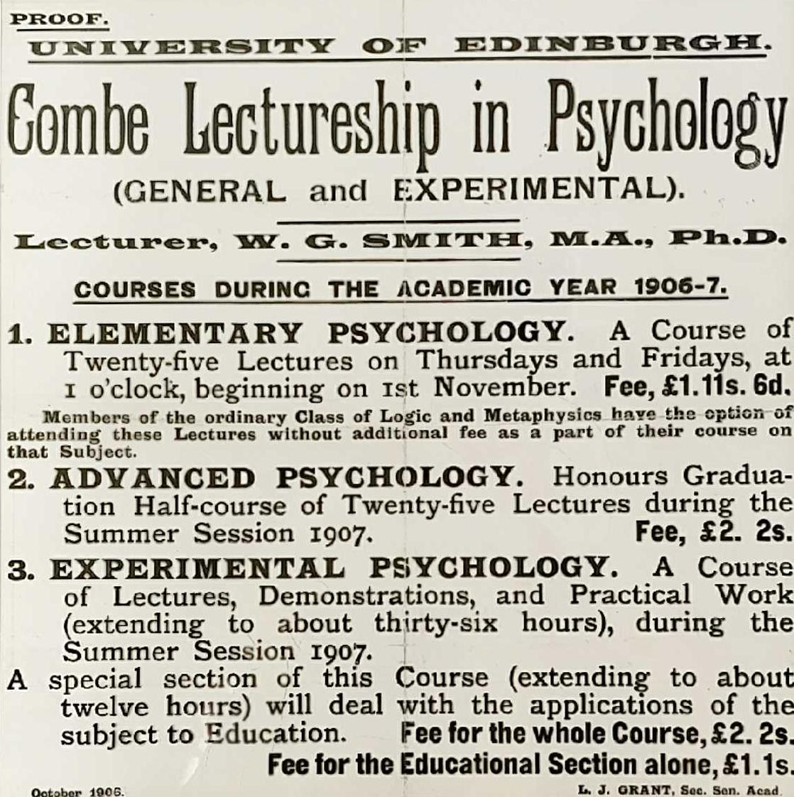
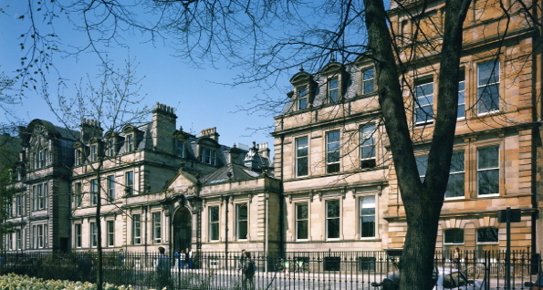
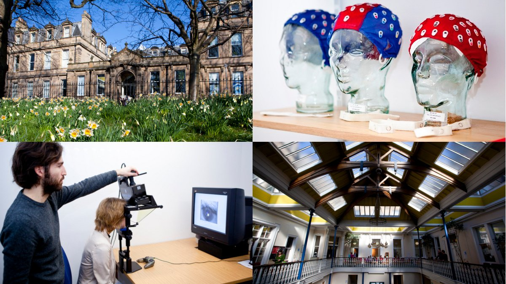
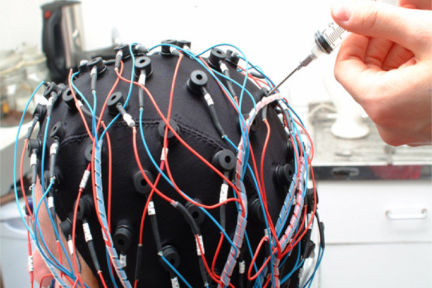
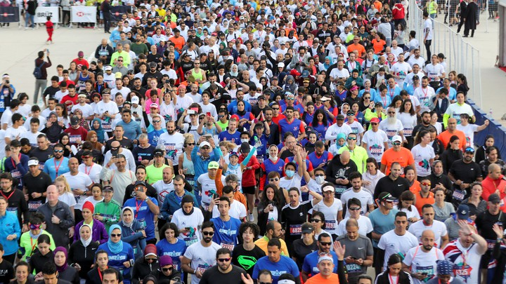
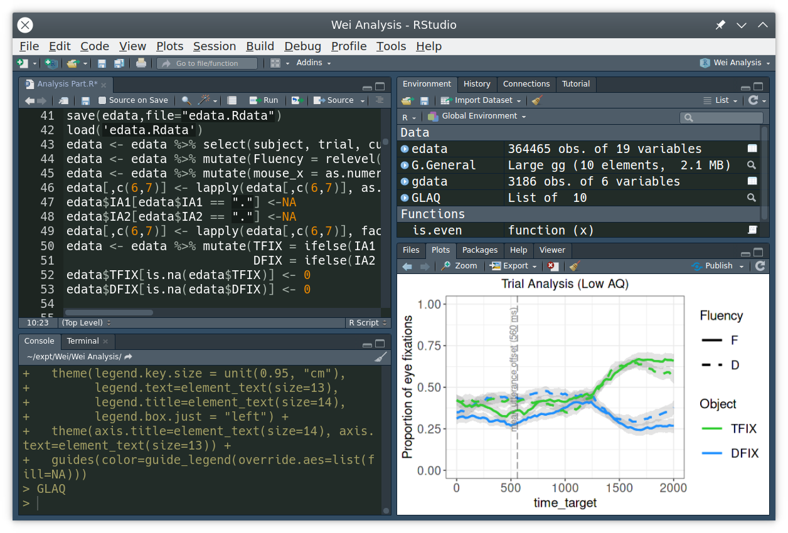

```{r setup, include=FALSE}
options(htmltools.dir.version = FALSE)
options(digits=4,scipen=2)
options(knitr.table.format="html")
xaringanExtra::use_xaringan_extra(c("tile_view","animate_css","tachyons"))
xaringanExtra::use_extra_styles(
  mute_unhighlighted_code = FALSE
)
library(knitr)
library(tidyverse)
#library(ggplot2)
knitr::opts_chunk$set(
  dev = "svg",
  warning = FALSE,
  message = FALSE,
  cache = TRUE,
  fig.showtext = TRUE
)
```

class: inverse

# Welcome

.pt2[
- .orange[today's session is being recorded.] Any information that you provide during a session is optional and in doing so you give us consent to process this information.
]

- these sessions will be stored by the University of Edinburgh for one year and published on our website after the event. Schools or Services may use the recordings for up to a year on relevant websites.

- by taking part in a session you give us your consent to process any information you provide during that session.
???
- there's some formal information here, so I'm going to give you a moment to read it

- if you're unhappy being recorded the best thing to do is to log out now, and view the recording that will be made available later
---
class: inverse

# Today

- Brittany Ballinger, Marketing and Communications

- Emma Caldwell, Marketing and Communications Manager

- .orange[Martin Corley, Head of Psychology]

- Shivani Gupta, Recent Graduate

- Harish Lokhun, Regional Manager, South Asia

- Raji Madhavan, Recent Graduate

- Sarah Moore, Marketing and Communications

- Toni Noble, Postgraduate Office

---
class: inverse

# Questions

.left-column[
.pt4[

]]
.right-column[

- you're welcome to ask questions at any time

- raise your virtual hand, and hopefully we'll spot it and ask you to speak

- if you prefer, you can type your question to "everyone" using chat

- feel free to call me Martin
]
???

- ...

- OK, that's the preliminaries over with
---
class: animated, fadeIn

# Edinburgh Psychology
.flex.items-center[.w-40.pa2[
- Edinburgh founded 1583

- psychology founded 1906

- currently ca. 40 faculty, ca. 800 students

- strong, diverse, research and teaching
]
.w-60.pa2[
.center[

]]]

???
- we're in our 115th year

- not been the easiest of years, but we're thriving
---
# World-Class Department

.pull-left[

- **22nd** in the world .tr[
(THE, 2021)
]

- **24th** in the world .tr[
(QS, 2020)
]
]
.pull-right[


.center.pt2.f3[
(home of Psychology at 7 George Sq)
]]


???

- consistently ranked among the top 25 places to research and study psychology in the world

- recently attracted some of the best young international scientists

---
# World-Leading Research

.flex.items-center[.w-50.pa2[

- ~ 42 Academic Staff

- ~ 20 Research Staff

- ~ 70 PhD students

- ~ 60 MSc students

- ~ 430 papers per year

]
.w-50.pa2[

]]

.pt2.center[
vibrant, busy, research culture
]

???
- five research groupings, strongly interdisciplinary

- many leading international scholars make their homes at Edinburgh

- opportunity to specialise in these areas for MSc research dissertation

---
# Developmental Science

.pull-left[

- thought, control, language

- atypical development

- dedicated baby and child lab

]
.pull-right[

]

---

# Human Cognitive Neuroscience
.pull-left[
- memory, perception, attention

- socio-cognitive function, executive control

-  EEG, fNIRS, behavioural labs


]
.pull-right[

]

---

# Individual Differences

.pull-left[
- personality, intelligence, health

- cognitive ageing

- Lothian Birth Cohort
]
.pull-right[

]

---
# Language and Communication
.pull-left[
- language production, comprehension

- dialogue, speech, meaning

- eyetrackers, ultrasound, behavioural labs

]
.pull-right[

]
---
# Social Psychology

.pull-left[
- crowds, social influence, identity

- couples, dietary choices


- interview suites, behavioural labs
]
.pull-right[

]

---

class: inverse


???
- as you can see, Edinburgh is at the exact centre of the earth (!)

- attracts the best international students 
  + a thriving international community of scholars

---
# MSc Psychological Research

.flex.items-center[.w-50.pa2[
- one-year MSc (Sep-Aug)

- intensive research training

- topic courses led by world-leading experts

- research dissertation

]

.w-50.pa2[

]]

---
# Modules

.pull-left[
- brain imaging in cognitive neuroscience

- clinical neuropsychology

- disorders of language functions

- language production

- problem-based social psychological research
]
.pull-right[
- qualtitative methods in psychological research

- research methods in social psychology

- seminar in intelligence

- specialist techniques in psychological research

- .orange[plus many other choices]
]
.tc[
[course details](http://www.drps.ed.ac.uk/21-22/dpt/ptmscpsyre1f.htm) available from April
]
---


.pull-left[
# Methods

- first UK university to start teaching R (since 2009)


- intense but rewarding training

- design, analysis, statistics

- programming, data science

]

--

.pull-right[
# Dissertation

- Individual Differences Psychology

- Human Cognitive Neuropsychology

- Social Psychology

- Psychology of Language

- Psychology
]

---
class: animated, fadeIn
.pull-left[
# Shivani Gupta

- .edi-softblue[MSc 2015]

- Research Assistant, Edinburgh

- Senior Architect, Fractal

.br3.pa2.edi-softblue[
Shivani helps enterprises leverage a combination of applied behavioural science, cognitive neuroscience, and design strategy
]]

.pull-right[
# Raji Madhavan

- .edi-softblue[MSc 2019]

- MRes Cognitive Science, UCL

- studying for PhD, Göttingen

.br3.pa2.edi-softblue[
Doing the MSc in Edinburgh prepared me to be a researcher - it opened my eyes to the world of academia, and pushed me to broaden my horizons
]]
---
class: bottom, left
background-image: url("index_files/img/edinburgh.jpg")
background-position: center
background-size: 100%


[.white[virtualvisits.ed.ac.uk]](https://virtualvisits.ed.ac.uk)


---
# How to Apply

- you have a good bachelors degree, typically in psychology

  + we may consider other degrees if you can demonstrate aptitude
  
- you speak good English, and [have taken a test](https://www.ed.ac.uk/studying/postgraduate/applying/your-application/entry-requirements/english-requirements), or [attended an exempted university](https://www.ed.ac.uk/studying/postgraduate/applying/your-application/entry-requirements/english-requirements/approved-universities)

- you apply before one of [3 annual deadlines](https://www.ed.ac.uk/ppls/psychology/prospective/postgraduate/msc/psychological-research/when-to-apply)

  + NB., final deadline for September 2021 entry: 1 April 2021

- some [funding is available](https://www.ed.ac.uk/ppls/psychology/prospective/postgraduate/msc/psychological-research/fees-and-funding) each year

---

class: center, inverse, middle
# Thank You

.pt[
&nbsp;
]

.br3.center.pa2.edi-softblue[
these slides: [mmbcorley.github.io/recruit2021](https://mmbcorley.github.io/recruit2021)

psychology: [www.psy.ed.ac.uk](http://www.psy.ed.ac.uk/)
]
