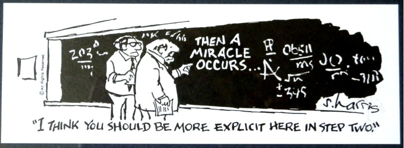
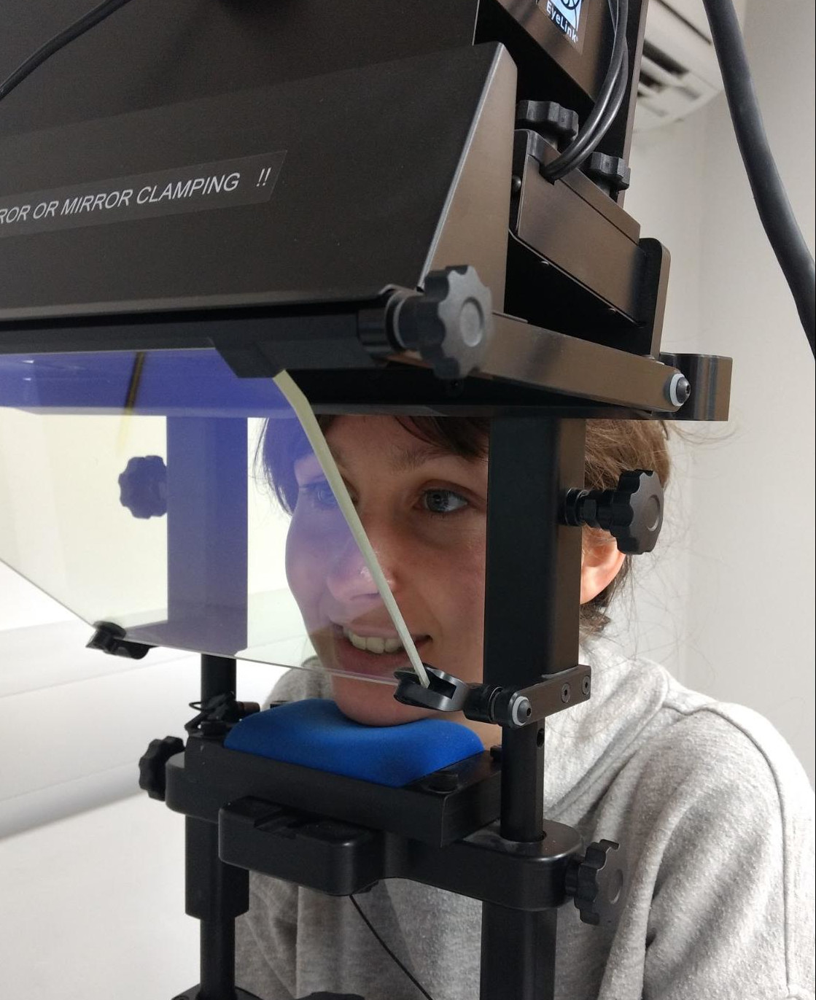
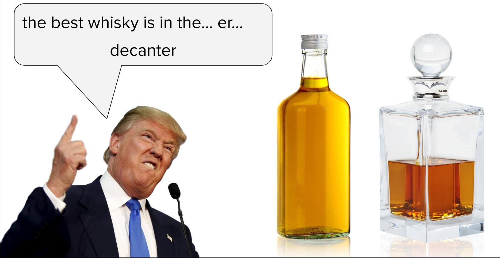
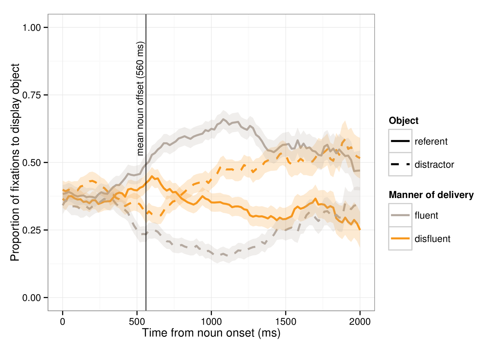

class: edi-softblue

# Research Interests
 
## focus on how humans communicate
--
 

## 1. how is human speech understood? .right[.small[e.g., articulation studies]]
## 2. understanding "beyond words" .right[.small[e.g., _um_ and _uh_]]
---
class: animated, bounceInRight
# Articulation Studies
.pull-left[.center[

]]
.pull-right[
- imaging of tongue surface
 

- typical research question:
 
> does predicting what you'll hear involve the language production system?
.right[.small[(e.g., Drake & Corley, 2015)]]
]
---
# Articulation Studies
.center[
<video width= "90%" controls>
  <source src="img/prediction.mp4" type="video/mp4">
  video not supported by this browser
</video>
]
???
maybe a slide to set the research question?
---
# Articulation Studies
.center[
<video width= "70%" controls>
  <source src="img/pred2.mp4" type="video/mp4">
  video not supported by this browser
</video>
]
---
class: center, middle

---
# Articulation Studies
.center[

]
<!-- .right[.small[(Drake & Corley, 2015)]] -->
---
class: animated, bounceInRight
# Disfluency Studies
.pull-left[
- eyetracking
 

- typical research question:
 
> how, and how quickly, does disfluency affect the way we understand what is being said?
.right[.small[(e.g., Loy, Rohde, & Corley, 2017)]]

]
.pull-right[
.center[

]]
---
# Disfluency Studies
 

.center[

]
---
# Disfluency Studies
.center[

]
.right[
<audio src="img/treasure.mp3" controls></audio>
]
---
# 
# Disfluency Studies
.center[

]
---
count: false
# Disfluency Studies
.center[

]
