# Ground Rules
<br>
- this course is pulled together from several sources
  - slides on gitbub, google slides
  - I'll make sure you have access
- feel free to ask questions at any time

<br>
<br>

--

.content-box-green[.center[
keep things informal]
]

---
class: edi-softblue, center, middle

```{r setup, include=FALSE}
options(htmltools.dir.version = FALSE)
options(knitr.duplicate.label = 'allow')
options(digits=2,scipen=1)
require(tidyverse)
require(ggplot2)
require(patchwork)
```

# Plan for the Course
<br>
## 1. What are Disfluencies?
## 2. Disfluencies and Prediction
## 3. What is Deception?
## 4. Disfluencies and Deception

???
- at the moment we don't intend to talk about *speech errors*
- though we could do...
---
class: edi-softblue, center, middle, animated, bounceInDown

# Disfluencies

---
# Disfluencies

> [...] phenomena that interrupt the flow of speech and do not add prepositional content to an utterance .right[Fox Tree (1995)]
???
- talk about "dis" vs "dys"
--

.pull-left[
- pauses
- (mid-word or -phrase) interruptions
- repairs
- repetitons
- *the* pronounced "thee", *a* pronounced "ay"
- .red[the fillers *uh* and *um*]
]

.pull-right[
.grayscale[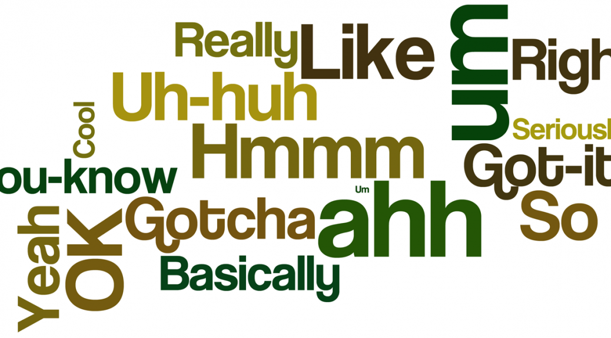
]]
---
# Disfluencies occur in informal speech
.center[
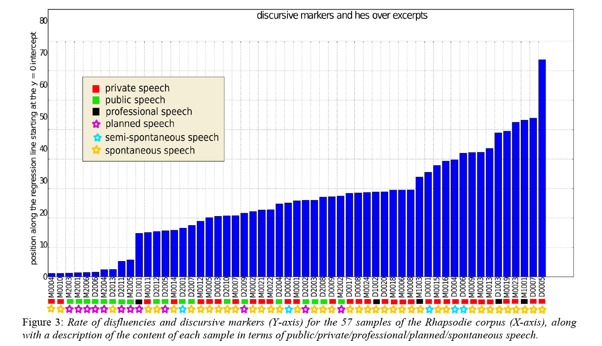
]
.right[.small[(Beliao & Lacheret, 2013)]]
???
- rhapsodie corpus (57 texts, 3 hours, 33,000 words)
- this includes hesitations and discourse markers
- of interest are the symbols on the x-axis
  - yellow star for spontaneous, red square for private
---
# What does disfluency sound like?

- extended duration
- creaky voice
- mid-word cutoffs (60%)
- coarticulation

example           | frequency
------------------|----------
the - the dog     | 88.0%
the(d) - the dog  | &nbsp;&nbsp;9.0%
the(d) - the cat  | &nbsp;&nbsp;2.0%
the(th) - the dog&nbsp;&nbsp;&nbsp;&nbsp;&nbsp;&nbsp;| &nbsp;&nbsp;0.3%
.right[.small[(Shriberg, 2001)]]

---
# Prosodic continuity
.pull-left[
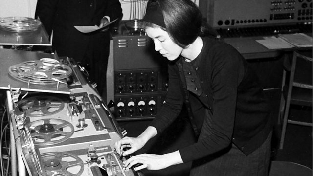
]

.pull-right[
- F0 tends to be low in disfluencies .right[.small[(Shriberg & Lickley, 1993)]]

- generally, F0 'resets' post-disfluency
- makes it possible to 'splice out' disfluencies in spontaneous speech
]
<!-- use mp3 audio, see code below -->
<br/>
<audio src="img/d1.mp3" controls></audio>
<br/>
<audio src="img/d2.mp3" controls></audio>
---
# Why does disfluency matter?
<br>
- up to 6 in 100 words of spontaneous speech .right[.small[(Fox Tree, 1995; Bortfeld et al., 2001)]]

- unnoticed by listeners? .right[.small[(Lickley & Bard, 1996)]]

- but produced in predictable circumstances...
---

# The Network Task
.pull-left[
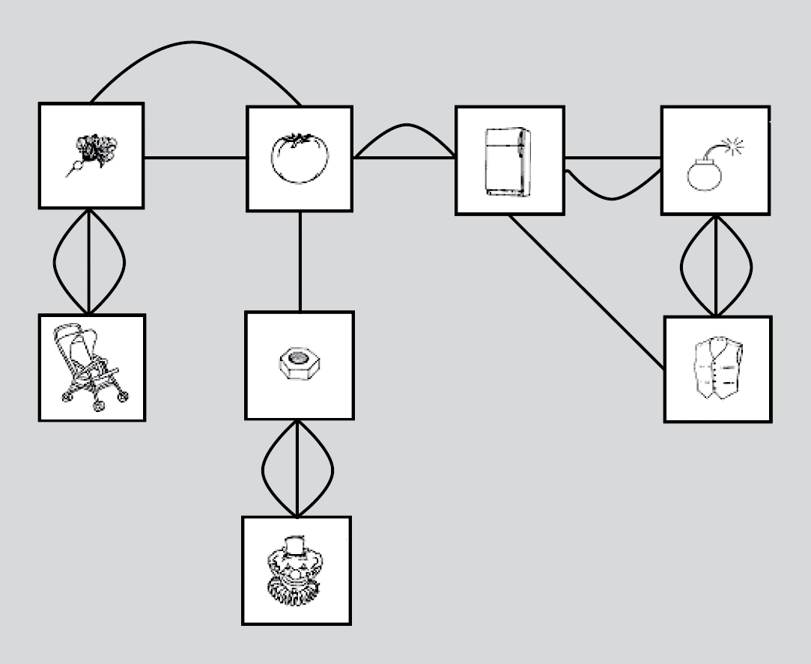
]

.pull-right[
- used to investigate speech planning .right[.small[(Levelt, 1983)]]
- used to investigate speech rate and disfluency .right[.small[(Oomen & Postma, 2001)]]
- vary lexical frequency, visual accessiblity, path complexity
]

---
# Schnadt and Corley (2006)

```{r do_plot, echo=F, fig.width=14}
d1 <- data.frame(freq=c('hf','lf'),percentage=c(19.2,36.9))
d2 <- data.frame(style=c('clear','blurred'),percentage=c(18.1,24.7))

p1 <- d1 %>% ggplot(aes(x=freq,y=percentage,fill=freq)) + geom_col() + theme_minimal(base_size = 24) + scale_fill_manual(values=c('#999999','#E69F00')) + ylim(0,40)

p2 <- d2 %>% ggplot(aes(x=style,y=percentage,fill=style)) + geom_col() + theme_minimal(base_size = 24) + scale_fill_manual(values=c('#E69F00','#999999')) + ylim(0,40) + scale_x_discrete(limits=c('clear','blurred'))

p1 + p2

```
???
- this is total disfluencies
  - majority were prolongations (~ `r (12.5 + 32.5) / (19.2 + 36.9) *100`%)
---
# Disfluencies tend to occur:
<br>
- before names of low-codability items
.right[.small[(Hartsuiker & Nootebaert, 2010)]]
- before open-class or unpredictable words
.right[.small[(Maclay & Osgood, 1959; Beattie & Butterworth, 1979)]]
- in uncertain answers to general knowledge questions
.right[.small[(Brennan & Williams, 1995)]]
- in lectures in the humanities!
.right[.small[(Schacter et al., 1991; 1994)]]

---
name: sound
# Filled pauses

- majority of the psychological literature has focused on *um* and *uh*

---
# How long do *um*s and *uh*s last?


.center[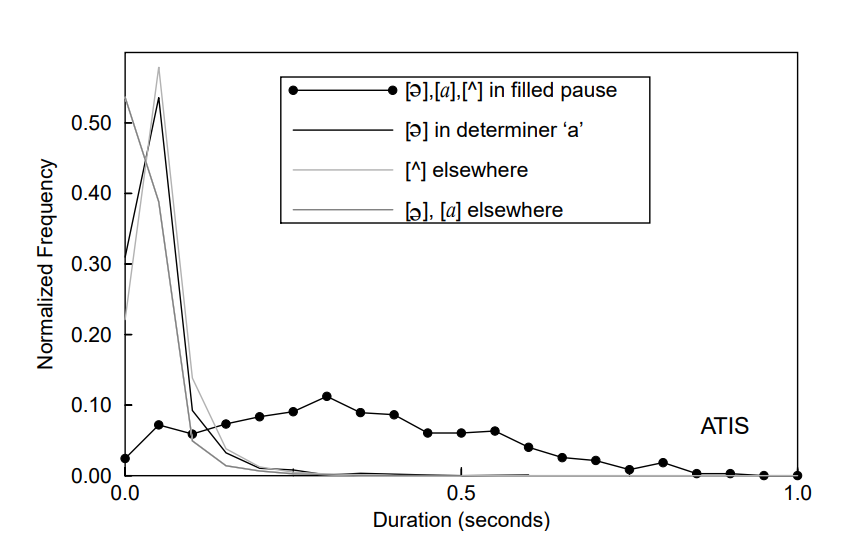]


.right[.small[(Shriberg, 2001)]]
???
- *because um and uh are salient!*
- ATIS is a corpus of human-computer air traffice speech
- note that long disfluencies are used in empirical studies
---
template: sound
--

- core argument: *um* and *uh* are 'words' .right[.small[(Clark & Fox Tree, 2002)]]
  - they conform to the "phonology, prosody, syntax, and semantics of English words"
???
- discuss what disfluencies are like in different languages?
--

  - they transmit interpersonal messages, such as "speakers want to hold the floor"
  - they should be considered as interjections, like *ah* and *oh*
???
- collateral channel

---
name: cft
# .red[Clark and Fox Tree (2002)]
- *um* is used when speaker is having more difficulty compared to *uh*
- *um* typically lasts longer than *uh*
  - though this is subjective in 2 out of 3 corpora examined
???
- and challenged by Kowal and O'Connell (2005)
---
name: cft1
template: cft
<br></br>
- suggest that speakers use *um* and *uh*, depending on circumstance
---
# *Um*mers and *uh*ers
.center[
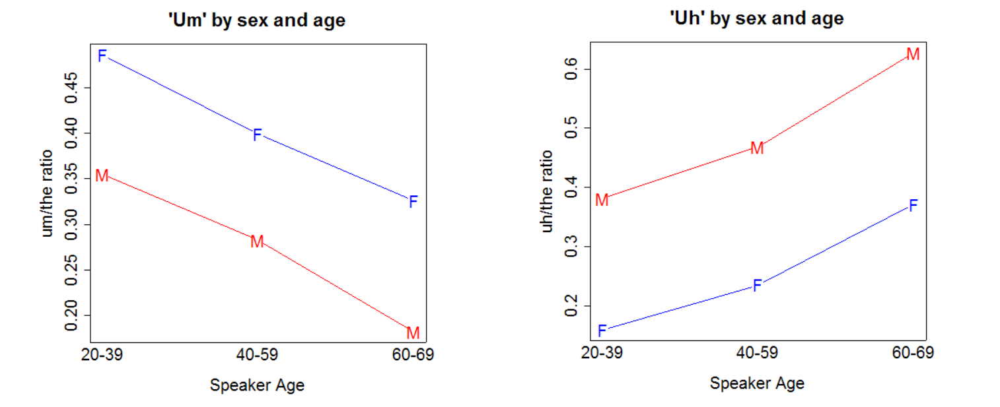
]
- data from 28k US telephone conversations, 12k speakers, 26m words
.right[.small[[(Liberman, 2005)](http://itre.cis.upenn.edu/~myl/languagelog/archives/002629.html)]]
???
- NB this is ratio of $x$/*the* as a proxy normalization of amount of speech/speaker
---
template: cft1
--
name: cft2
<br></br>
- suggest that filled pauses are used *intentionally*

---
# Finlayson and Corley (2006)
<br/>
- .orange[**fluency items**] and **alignment items**

.center[

]

- participants are either in **monologue** or **dialogue**
???
- sequential naming paradigm
  - alignment items show that participants are affected by interlocutor
---
# Finlayson and Corley (2006)

```{r echo=F, fig.width=14}
dd <- data.frame(confederate=gl(2,2,4,labels=c('absent','present')),
                 scripted=gl(2,1,4,labels=c('preferred','dispreferred')),
                 proportion=c(.18,.12,.04,.59))
p3 <- dd %>% ggplot(aes(x=confederate,y=proportion,fill=scripted)) + geom_col(position="dodge") + theme_minimal(base_size = 24) + scale_fill_brewer() + ylim(0.,.6)
de <- data.frame(confederate=gl(2,2,4,labels=c('absent','present')),
                 image=gl(2,1,4,labels=c('easy','hard')),
                 proportion=c(.10,.31,.11,.35))
p4 <- de %>% ggplot(aes(x=confederate,y=proportion,fill=image)) + geom_col(position="dodge") + theme_minimal(base_size = 24) + scale_fill_manual(values=c('#999999','#E69F00')) + ylim(0,.6)

p4 + p3
```
???
- **start on the right**
  - a big influence of confederate presence

- on the left, *no evidence* that disfluencies are "intentional"

---
template: cft2

--

- suggest that *um* and *uh* should differentially affect listeners
---
# Fox Tree (2001)
<br>
- listeners faster to identify words after *uh*, but not *um*, in Dutch .right[.small[(Fox Tree, 2001)]]

  - "fluent" materials had 380ms (*uh*) vs 1004ms (*um*) silent pauses

  - the "fluent *um*" materials may just have seemed disfluent
<br>

---
# *Um* and *uh* are not intentional words
.left-column[
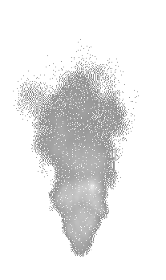
]
.right-column[

- disfluencies are not (always) *intentional*

- they can still function as *signals*
  - in the same way that smoke signals fire
  - as a product of, e.g., cognitive effort

- are listeners sensitive to these signals?
]

---
# Arnold et al. (2004)
.center[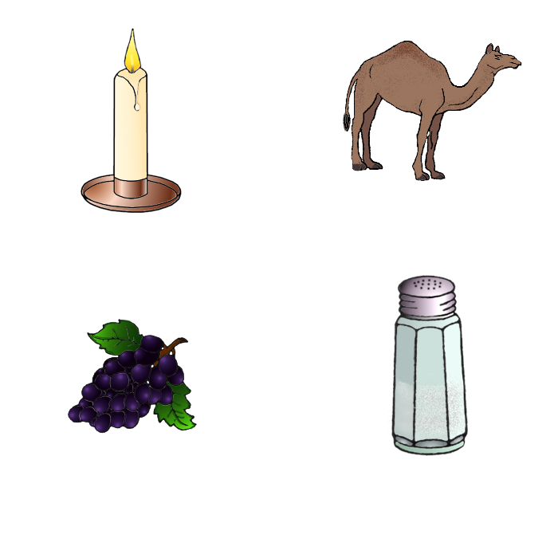]
> "Put the grapes above the candle.  Now put the camel..."<br>
> "Put the grapes above the candle. Now put *thee uh* camel...
???
- it's cognitively taxing to produce *new* information
---
# Arnold et al. (2004)
.center[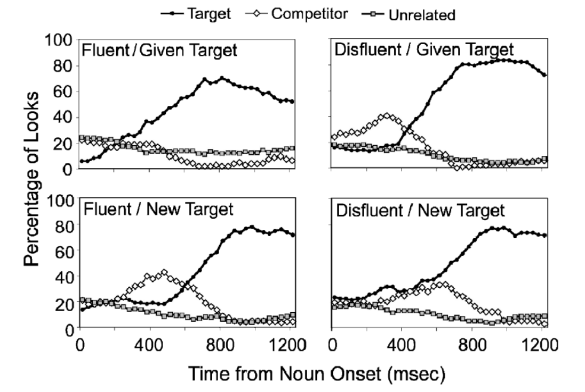]
---
count: false
# Arnold et al. (2004)
.center[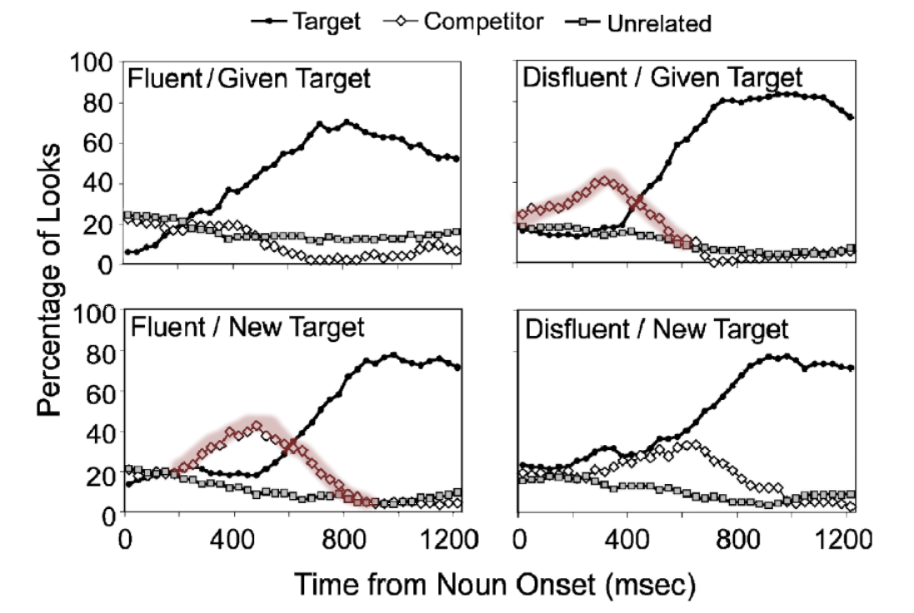]
???
- these are the cases where participants are expecting the opposite of what they hear
---
class: edi-softblue, center, middle, animated, bounceInDown

# Research on Prediction

.Large[[Prezi Presentation](https://prezi.com/3eesnhdw_jmd/?token=63946009903bfb80143c31d5230f630071b110321374701468fc8a2b57922724&utm_campaign=share&utm_medium=copy)]

---
class: edi-softblue, center, middle, animated, bounceInDown
<!-- here we have the deception research -->

# Research on Deception

.Large[[Slides Presentation](https://docs.google.com/presentation/d/1oBFoHvNyuvcEIx18j4hVO0jiWTeFjUSReFheegujsIg/edit?usp=sharing)]

---
# Gesture
.pull-left[
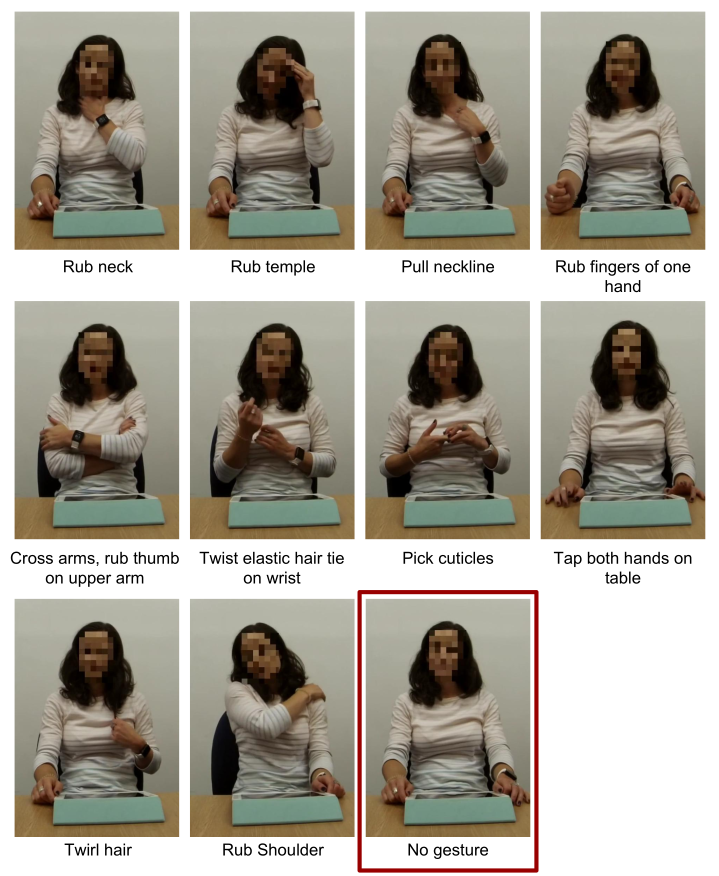
]

.pull-right[
## King et al. (under review)

- body language (also) traditionally associated with deception
- use fluent utterances with videos of different body language
]
---
# Future Work
.center[
<video width="85%" controls>
  <source src="img/trumpcapture.mp4" type="video/mp4">
  video not supported by this browser
</video>
]