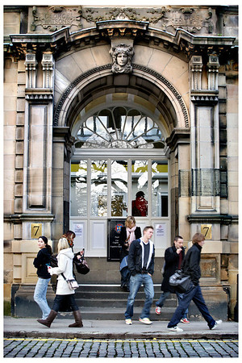

```{r setup, include=FALSE}
options(htmltools.dir.version = FALSE)
options(digits=4,scipen=2)
options(knitr.table.format="html")
xaringanExtra::use_xaringan_extra(c("tile_view","animate_css","tachyons"))
xaringanExtra::use_extra_styles(
  mute_unhighlighted_code = FALSE
)
#library(ggplot2)
knitr::opts_chunk$set(
  dev = "svg",
  warning = FALSE,
  message = FALSE,
  cache = TRUE,
  fig.showtext = TRUE
)
```
class: inverse
.pull-left[

.center[
## Psychology Town Hall

.pt2[# WELCOME
]
.pt3[## start: 12 noon
]]

]
.pull-right[
&nbsp;
.center[

]]
---
# Housekeeping

- this session is being recorded

- please keep your mic muted (unless asking a question)

- to ask a question, either

  + type your question in the chat box (to "everyone")

  + raise your virtual hand and unmute when asked to
---
# Key Points

- we are bound by Scottish Government rules

  + at present there are no plans beyond "level zero"
  
--

- we are bound by University decisions

  + they know that some people may not be able to be in Edinburgh

  + they are working on this, but there are no formal decisions yet

---
# In Psychology

- we want to teach on-campus, in-person, where possible

  + the drivers for this are social distancing and room availability

- where we can't teach on-campus we will teach online

  + more synchronous ("live") online classes, timetabled
  
--

- we know that some students won't be on campus

  + we are planning to support them
---
class: inverse, center, middle

# we can only speak for Psychology

## other Schools may have different plans
---
class: bottom, left
background-image: url("index_files/img/edinburgh.jpg")
background-position: center
background-size: 100%


[.white[virtualvisits.ed.ac.uk]](https://virtualvisits.ed.ac.uk)


